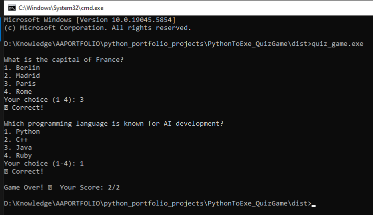

# Python Quiz Game – Convert Python Script to Windows Executable

This project showcases a simple command-line quiz game developed in Python.
It reads questions and answers from a JSON file and allows users to test their knowledge interactively.
Additionally, it demonstrates how to convert a Python script into a standalone Windows executable using PyInstaller.

**Learning**: It created a 7.8 MB file. Quite impressive.  
NodeJS has similar functionality but the file size of EXE it creates is bigger!

## Features

- Loads quiz questions and answers from a JSON file.
- Interactive command-line interface for user engagement.
- Provides immediate feedback on user responses.
- Displays the final score at the end of the quiz.
- Converts the Python script into a `.exe` file for Windows users.

## Prerequisites

- Python 3.x installed on your system.
- `pip` package manager for installing dependencies.
- PyInstaller for converting the script into an executable.

## Setup Instructions

1. **Clone the Repository:**

   ```bash
   git clone https://github.com/amitguptaforwork/python_portfolio_projects.git
   cd python_portfolio_projects/PythonToExe_QuizGame
   ```

2. **Install Dependencies:**

   Ensure you have PyInstaller installed:

   ```bash
   pip install pyinstaller
   ```

3. **Run the Quiz Game:**

   Execute the Python script to start the quiz:

   ```bash
   python quiz_game.py
   ```

4. **Convert to Windows Executable:**

   Use PyInstaller to create a standalone `.exe` file:

   ```bash
   pyinstaller --onefile quiz_game.py
   ```

   The executable will be located in the `dist` directory.

## Usage

- Run the executable (`quiz_game.exe`) from the command line or by double-clicking it.
- Answer the questions presented in the terminal.
- At the end of the quiz, your score will be displayed.



## Project Structure

```plaintext
PythonToExe_QuizGame/
├── quiz_data.json       # JSON file containing quiz questions and answers
├── quiz_game.py         # Main Python script for the quiz game
├── README.md            # Project documentation
└── dist/
    └── quiz_game.exe    # Generated Windows executable
    ├── quiz_data.json   # JSON file containing quiz questions and answers
```

## License

This project is licensed under the MIT License. See the [LICENSE](LICENSE) file for details.
